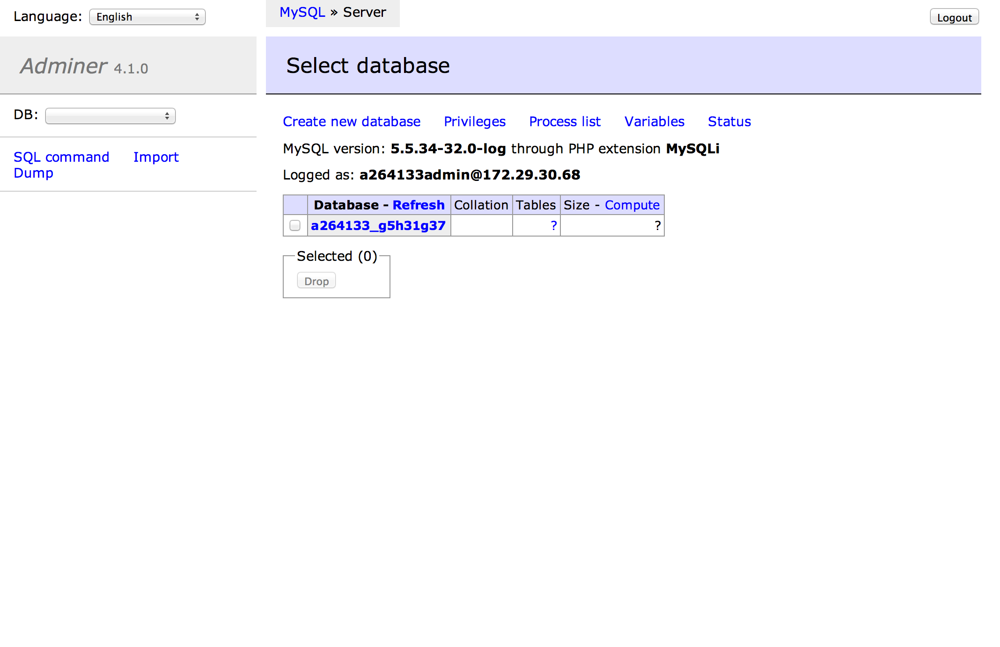

# Laravel Adminer

It's a embedded [adminer](http://www.adminer.org/) in Laravel4 application.

## Installation

Add dependency in `composer.json`

```json
"require-dev": {
    "kohkimakimoto/laravel-adminer": "0.*"
}
```

Run `composer upadte` command.

```
$ composer update
```

Add `AdminerServiceProvider` to providers array in `app/config/app.php`

```php
'providers' => array(
    ...
    'Kohkimakimoto\Adminer\AdminerServiceProvider',
),
```

Add a routing definition to `AdminerController@index`. You can use a route you like. The following is example.

```php
Route::any('adminer', 'Kohkimakimoto\Adminer\Controllers\AdminerController@index');
```

Finally, Add a little code at the end of `public/index.php`. You must write the additional code after `$app->run();`.

```php
$app->run();

use Kohkimakimoto\Adminer\Facade\Adminer;
if (Adminer::shouldRequestToAdminer()) {
    require Adminer::path();
}
```

OK. Access the uri you defined by your browser. you can see the adminer database management page.



## Author 

Kohki Makimoto <kohki.makimoto@gmail.com>

And adminer is created by [Jakub Vrána](https://github.com/vrana).


